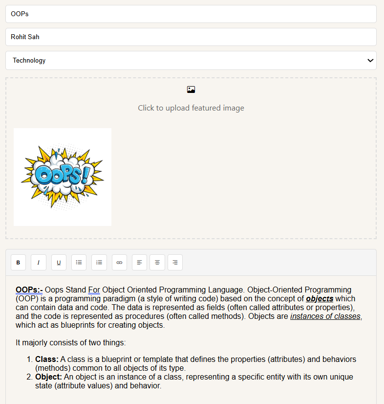
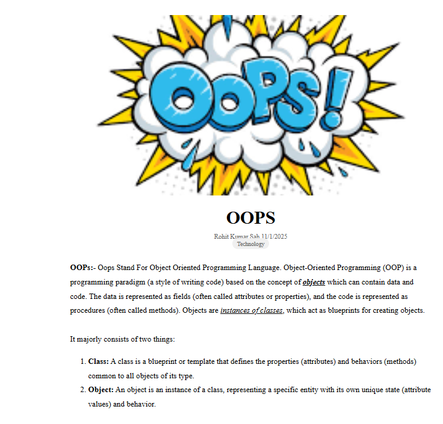

# Introduction

The Blog Website project is a fully responsive web-based platform designed for users to write, and preview blog posts. It allows users to explore featured and popular categories of blogs, write their own articles using a built-in text editor, and preview them before publishing. The goal is to provide an engaging and user-friendly blog platform.

### Folder Structure


# Features and How To Use

- index.html
    - This file serves as the primary entry point for a blog website, providing a well-structured, responsive, and interactive user interface.
    - The primary feature of this page is navigation to the `Write` page. It serves as the homepage and includes several sections: Header, Main Section, Featured Section, Popular Section, Newsletter, and Footer. These sections are static and do not have any functionality. They have been added to enhance the attractiveness and improve the website's UI.
    - After entering the Blog homepage, you can explore the page to review the UI. Once done, you can navigate to the "Write" page to create a rich blog. Refer to the image below for guidance on how to access the "Write" page.
    
    
- Write.html
    - This file serves as the blogging interface for creating, editing, and managing blogs on the website. It provides a simple and user-friendly interface to enhance the blogging experience.
    - The primary feature of this page is to allow users to write and format their blogs efficiently. It contains multiple sections, including a header, blog metadata inputs, a rich text editor, and buttons for publishing and previewing the blog.
        1. **Rich Text Editor:**  The editor starts with fields for writing the title of the blog, the author's name, selecting the category of the blog, and uploading an image for the blog. It also includes a toolbar with multiple formatting options, such as:
            - Bold, Italic, and Underline for text styling.
            - Ordered and Unordered lists for structuring content.
            - Adding links.
            - Aligning text to the left, center, or right.
            > Users can activate any of these toolbar options and begin writing their content seamlessly.
        2. **Publish Button:** When the "Publish" button is clicked, it validates whether all the required fields are filled. If validation is successful, it displays the following message:
            ```
            alert('Your blog has been published successfully!');
            ```
            After this, the page redirects to the homepage, allowing users to create another blog.
        3. **Preview Button:**  When the "Preview" button is clicked, the blog content is validated, and the user is redirected to the preview page. The features of the preview page will be described below.

        4. **Add to Feature Button:** When the "Publish" button is clicked, it validates whether all the required fields are filled. If validation is successful, it displays the following message:
            ```
            alert('Your blog has been featured successfully!');
            ```
             After this, the page redirects to the homepage, allowing users to create another blog.
        > Here are The Example Of writing of Text editor
        

- previewBlog features
    - When the user clicks the **Preview Button** in `write.html` page,if everything is valid, the blog data is gathered into an object, and it is stored in the session storage in JSON format.

    - ## About Session Storage
        Session Storage is a web storage mechanism that allows you to store data for the duration of the page session. This means the data will persist as long as the user does not close the browser tab. Once the tab is closed, the data is lost.

        Session storage can be accessed using the sessionStorage object. Data is stored as key-value pairs, and you can store complex data like objects by converting them into strings using JSON.stringify(). You can then retrieve and use the data with JSON.parse().
    
        ```
        const blogData = {
            title: validData.title,
            author: validData.author,
            category: validData.category,
            content: validData.content,
            image: uploadedImage
        };

        sessionStorage.setItem('previewBlog', JSON.stringify(blogData));//Store the blog data in sessionStorage as a JSON string
        ``` 

    - When the user clicks the **Preview Button** on `write.html`, all the blog data is stored in session storage in JSON format. The data is then parsed and displayed on the previewBlog.html page in a structured manner, as shown in the image below.
    

# Technical Details
- Frontend: HTML, CSS (with Bootstrap icons for styling)
- JavaScript: Vanilla JavaScript for DOM manipulation and interactive features.
- Responsive Design: CSS media queries for mobile-friendliness.


# Future Enhancements
- User Authentication: Implement user accounts for personalized experiences.
- Comment Section: Allow readers to comment on blog posts.
- Database Integration: Store blog posts in a database for persistent data storage and it will help to create featured post cards and it will help to track popular section properly.
- Dark Mode: Add a dark mode toggle for better accessibility.

        


