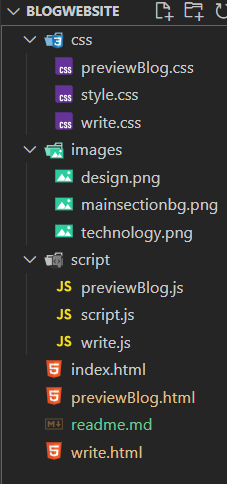

# Introduction

The Blog Website project is a fully responsive web-based platform designed for users to write, and preview blog posts. It allows users to explore featured and popular categories of blogs, write their own articles using a built-in text editor, and preview them before publishing. The goal is to provide an engaging and user-friendly blog platform.

### Folder Structure

# Features

